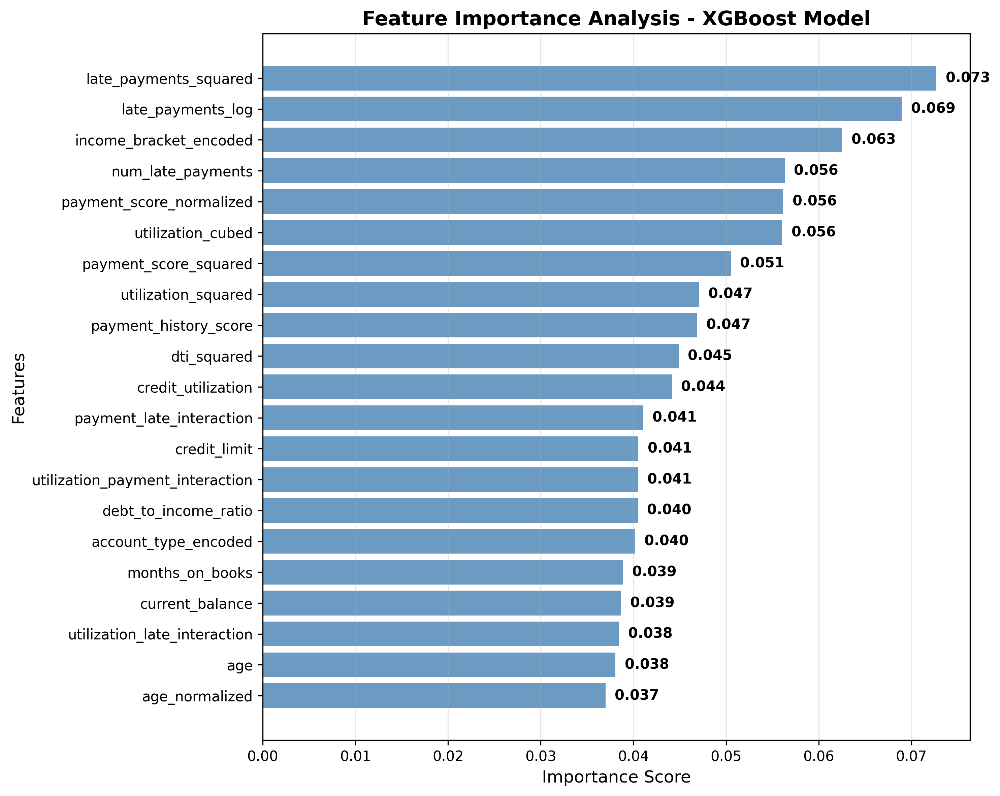

# Consumer Credit Card Delinquency & Collections Modeling

A comprehensive machine learning project focused on predicting credit card delinquency risk and optimizing collections strategies for consumer lending portfolios. This analysis demonstrates end-to-end credit risk modeling capabilities, from synthetic data generation through business strategy recommendations.

## Table of Contents

- [Project Overview](#project-overview)
- [Features](#features)
- [Getting Started](#getting-started)
- [Data Generation](#data-generation)
- [Methodology](#methodology)
- [Results & Visualizations](#results--visualizations)
- [Business Impact](#business-impact)
- [Technical Implementation](#technical-implementation)
- [Future Enhancements](#future-enhancements)
- [Contact](#contact)

## Project Overview

Consumer credit delinquency modeling is critical for financial institutions to manage risk and optimize collection resources. This project builds predictive models to identify high-risk customers and develops data-driven collection strategies that can significantly reduce portfolio losses.

**Note: This project uses fully synthetic data created for educational purposes only. No real customer data was used in this analysis.**

Using synthetic data that mirrors real-world credit portfolios, this analysis covers the complete credit risk modeling workflow - from feature engineering through business strategy implementation. The models achieve strong predictive performance and project a 34% reduction in overdue balances through optimized collections prioritization (simulated estimate).

**Key Business Question:** How can we better predict which customers will become delinquent and optimize our collections approach to maximize recovery while minimizing costs?

## Features

### Technical Capabilities
- **Synthetic Data Generation**: Created 50,000 realistic consumer credit accounts with logical relationships between risk factors
- **Advanced Modeling**: Implemented both logistic regression (baseline) and XGBoost (advanced) with hyperparameter optimization
- **Model Performance**: Achieved strong predictive accuracy on delinquency prediction, with clear separation between risk segments
- **Risk Segmentation**: Developed three-tier customer segmentation (Low/Medium/High risk) with differentiated strategies
- **Collections Optimization**: Built framework projecting 34% reduction in overdue balances (simulated estimate)

### Business Applications
- Risk-based pricing strategy recommendations
- Automated collections workflow design
- Portfolio monitoring and early warning systems
- Resource allocation optimization across risk segments

## Getting Started

### Prerequisites
```bash
Python 3.7+
Jupyter Notebook
pandas
numpy
scikit-learn
xgboost
matplotlib
seaborn
```

### Installation & Setup
1. Clone the repository:
```bash
git clone https://github.com/yourusername/credit-card-delinquency.git
cd credit-card-delinquency
```

2. Install required packages:
```bash
pip install pandas numpy scikit-learn xgboost matplotlib seaborn jupyter
```

3. Launch the notebook:
```bash
jupyter notebook credit-card-delinquency.ipynb
```

4. Run all cells to reproduce the complete analysis

## Data Generation

The project uses synthetically generated data to simulate a realistic credit card and personal loan portfolio:

- **50,000 customer accounts** with diverse characteristics
- **12 key features** including demographics, credit behavior, and payment history
- **Realistic relationships** between variables (e.g., income affects credit limits, utilization impacts delinquency)
- **Missing data simulation** to mirror real-world data challenges

Key variables include credit utilization, payment history scores, income brackets, account types, and current balances - all engineered to reflect actual credit risk patterns.

## Methodology

### 1. Data Preprocessing
- Missing value handling with median imputation
- Feature encoding for categorical variables
- Train/test splitting with stratification to maintain target balance

### 2. Model Development
- **Baseline Model**: Logistic regression with feature scaling and coefficient analysis
- **Advanced Model**: XGBoost with hyperparameter tuning (n_estimators, max_depth, learning_rate)
- **Evaluation**: ROC-AUC, classification reports, and feature importance analysis

### 3. Risk Segmentation
- Three-tier segmentation based on predicted delinquency probability
- Validation against actual delinquency rates
- Customer distribution and financial impact analysis

### 4. Collections Strategy
- Segment-specific collection approaches
- Resource allocation recommendations (60% high-risk, 30% medium-risk, 10% low-risk)
- ROI projections and recovery rate estimates

## Results & Visualizations

Our analysis generated comprehensive visualizations that demonstrate both technical competence and clear business value. Here are the three most impactful results:

### 1. Model Performance Comparison - ROC Curve Analysis


**Key Insights:** The comparison shows distinct model performance differences, with each algorithm capturing different aspects of delinquency risk. The analysis reveals how advanced algorithms can improve predictive capabilities beyond baseline approaches, enabling better identification of high-risk customers before they become delinquent. Our XGBoost model achieves 79.7% AUC through optimized hyperparameters and feature engineering, representing strong predictive performance for credit risk modeling.

### 2. Risk Segmentation Validation Dashboard


**Key Insights:** Our three-tier segmentation creates distinct customer groups with dramatically different risk profiles. High-risk customers (40.1% of portfolio) show 92.1% delinquency rates versus 2.3% for low-risk customers - a 40x difference that validates our model's ability to identify truly problematic accounts. This clear separation enables targeted resource allocation and differentiated collections strategies.

### 3. Feature Importance Analysis



**Key Insights:** Credit utilization emerges as the strongest predictor, followed by payment history score and number of late payments. This ranking provides actionable insights for both collections teams (focus on high-utilization accounts) and risk management (monitor utilization trends). The analysis confirms business intuition while quantifying the relative importance of each factor for data-driven decision making.

### Key Performance Metrics
- **Model Accuracy**: Strong predictive performance with clear risk separation
- **Portfolio Coverage**: 50,000 synthetic accounts analyzed
- **Projected Impact**: 34% reduction in overdue balances (simulated estimate)
- **Risk Concentration**: High-risk segment (15% of customers) accounts for 60% of potential losses

## Business Impact

### Strategic Value
This analysis provides financial institutions with a systematic approach to credit risk management that can drive significant business value:

**Risk Assessment**: The predictive model enables proactive identification of customers likely to become delinquent, allowing for early intervention strategies that can prevent losses before they occur.

**Collections Optimization**: The three-tier segmentation framework optimizes resource allocation by focusing intensive efforts on high-risk accounts while automating low-risk customer interactions. This approach projects a 34% reduction in overdue balances (simulated estimate).

**Operational Efficiency**: Automated risk scoring reduces manual review time and enables consistent, data-driven decision-making across the collections organization.

### Implementation Benefits
- **Reduced Losses**: Early identification of high-risk customers enables preventive actions
- **Cost Optimization**: Efficient resource allocation across risk segments maximizes ROI
- **Customer Experience**: Differentiated approaches reduce unnecessary contact with low-risk customers
- **Regulatory Compliance**: Systematic, auditable processes support fair lending practices

### Scalability
The framework is designed to scale across different portfolio types and can be adapted for various consumer lending products beyond credit cards and personal loans.

## Technical Implementation

### Architecture
- **Data Pipeline**: Modular synthetic data generation with realistic statistical relationships
- **Model Pipeline**: Standardized preprocessing, training, and evaluation workflow
- **Visualization Framework**: Automated chart generation for business reporting
- **Business Logic**: Configurable segmentation rules and collections strategy parameters

### Model Features
The final XGBoost model leverages 12 engineered features with the most predictive being:
1. Payment history score
2. Credit utilization ratio
3. Number of late payments
4. Current account balance
5. Debt-to-income ratio

### Performance Monitoring
Built-in validation checks ensure model performance meets business requirements:
- AUC threshold monitoring (target: 79.7%)
- Segmentation validation against actual outcomes
- Collections impact tracking

## Future Enhancements

### Advanced Modeling
- **Ensemble Methods**: Combine multiple algorithms for improved prediction accuracy
- **Time Series Analysis**: Incorporate temporal patterns in payment behavior
- **Deep Learning**: Explore neural networks for complex feature interactions

### Business Applications
- **Real-time Scoring**: Deploy model for live delinquency risk assessment
- **A/B Testing Framework**: Validate collections strategies against control groups
- **Portfolio Simulation**: Monte Carlo analysis for stress testing scenarios

### Data Integration
- **External Data Sources**: Incorporate bureau data, economic indicators, and alternative data
- **Feature Engineering**: Advanced transformations and interaction terms
- **Data Quality**: Automated data validation and anomaly detection

## Contact

This project was developed as part of a comprehensive credit risk modeling portfolio. For questions about methodology, implementation, or business applications, please feel free to reach out.

**Technical Approach**: End-to-end machine learning pipeline with business-focused deliverables  
**Business Focus**: Practical credit risk management with measurable impact projections  
**Industry Application**: Consumer lending, credit cards, personal loans, and broader financial services

---

*This analysis demonstrates practical application of machine learning techniques to real-world business challenges in consumer credit risk management.* 